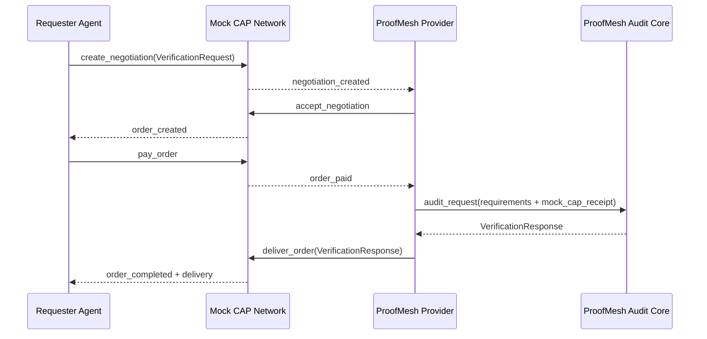

# ProofMesh Architecture Draft

This page provides diagrams and text that can be reused in the Kaggle writeup.

## Mock CAP Lifecycle



## Component Boundaries

```text
examples/run_mock_cap_demo.py
  |
  | requester-side demo command
  v
src/proofmesh/cap_mock.py
  |
  | negotiation, payment event, ledger, delivery log
  v
src/proofmesh/provider.py
  |
  | provider accepts paid order and calls audit core
  v
src/proofmesh/auditor.py
  |
  | claim-level verification
  v
VerificationResponse JSON
```

## Evidence Artifacts

- `artifacts/phase2/mock-cap-demo-log.json`
- `artifacts/phase2/mock-cap-demo-log.md`
- `artifacts/phase2/mock-cap-batch-summary.json`
- `artifacts/phase2/mock-cap-batch-summary.md`

